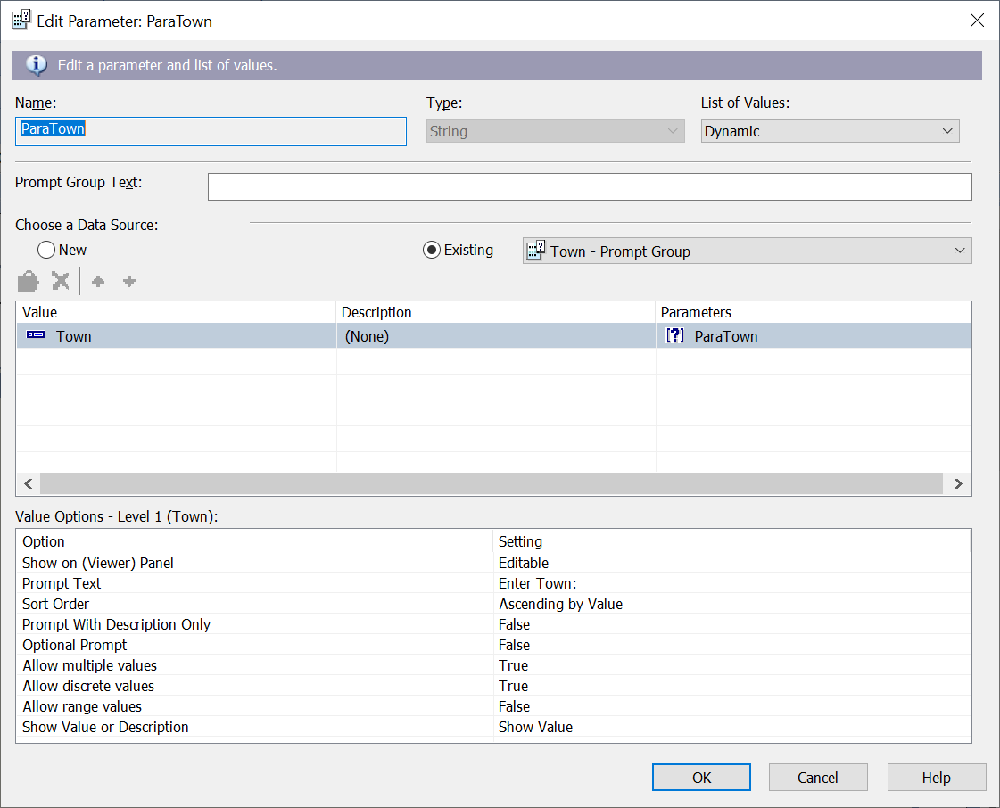

# Report Design and Field Script for Patient Count by Age Group and Residence Report
## Data Source
### AgeGroupView

## Report Body Design

## Field Explorer 

## Add a Tabular Field in the Report Detail Section for Patient Full Name
Right click Formula Fields inside the Formula Explorer, choose New..., and type in "Name" as the field name to create a formula field. In the Formula Workshop, add code to combine both the first name and the last name fields as the New "Name" tabular Field.  

Right click the Name field and choose the option "Insert to Report" to add the Name field to the report.
## Create a Parameter Inside the Parameter Fields to Filter Residence Location  
Right click Parameter Fields inside the Formula Explorer, choose New... to create a parameter called ParaTown to filter the report.  

## Add the Parameter ParaTown to the Report Record
Under the menu "Report", click on the submenu "Selection Formulas", then choose "Record..."  
The Formula Workshop dialog box is presented as follows. Add the code, save, and close the Formula Workshop.  
.
## Insert Count of the Subgroup Records to the SubGroup Footer Town or the Group #2 Section
Under the menu Insert, choose Summary to add the count of the records from the Town to the Subgroup footer 

## Insert Count of the Age Group Records to the Group Footer or the Group #1 Section and the Report Footer
Under the menu Insert, choose Summary to add the count of the records of the age group to both the group footer and the report footer 
The record count in the age group footer indicates the total number for the specified age group. The record count in the age group report footer indicates the total number of all age groups. 

## Get All the Selected Residence Locations 
The formula field ValueofParaTown is created to get all the residence locations chosen by user.  

