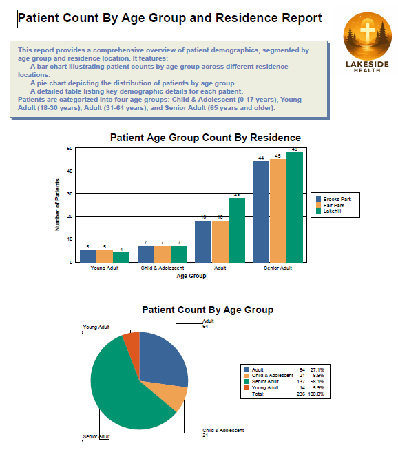
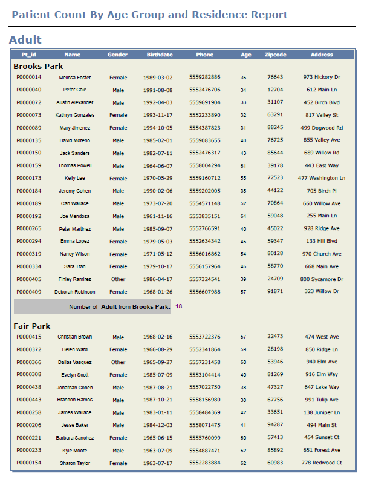
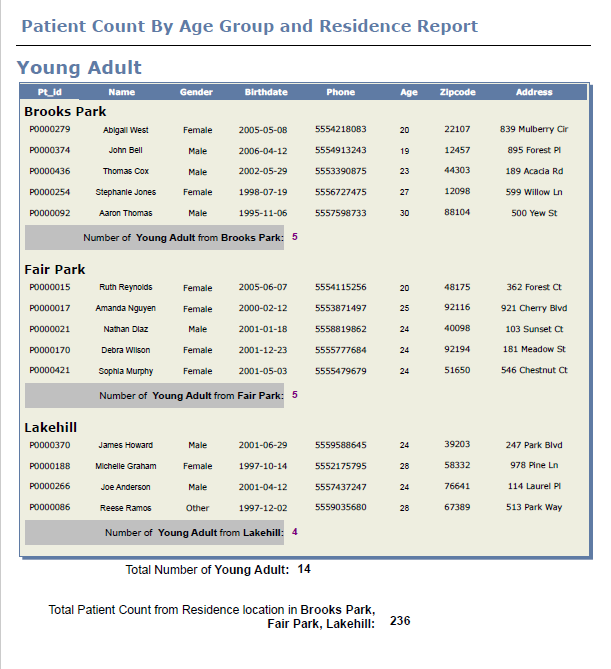

# Patient Count by Age Group and Residence Report Preview
 
This report provides a comprehensive overview of patient demographics, segmented by age group first and then by their residence location. It features:
	A bar chart illustrating patient counts by age group across different residence locations.
	A pie chart depicting the distribution of patients by age group.
	A detailed table listing key demographic details for each patient.
Patients are categorized into four age groups: 
<ul>
    <li>Child & Adolescent (0-17 years)</li>
    <li>Young Adult (18-30 years)</li>
    <li>Adult (31-64 years)</li>
    <li>Senior Adult (65 years and older)</li>
</ul>
The following is the preview of the partial report.
  

  
  

