# Length of Stay By Patient Service Report Development
## Data Source
The data of this report is derived from the view <b>EncounterView</b> in the database <b>LakesideInpatient</b>.
  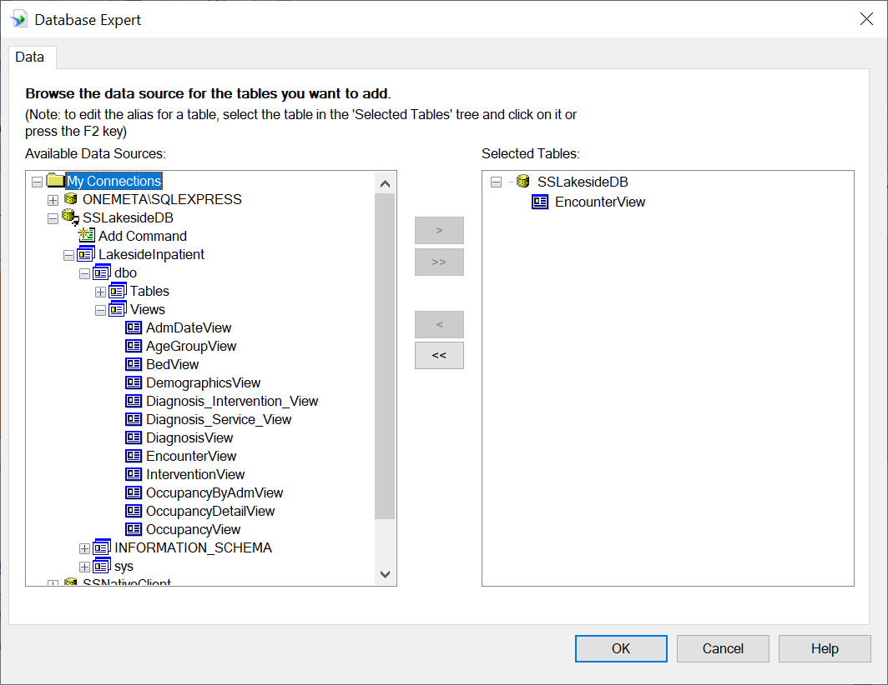
## Report Design Panel 
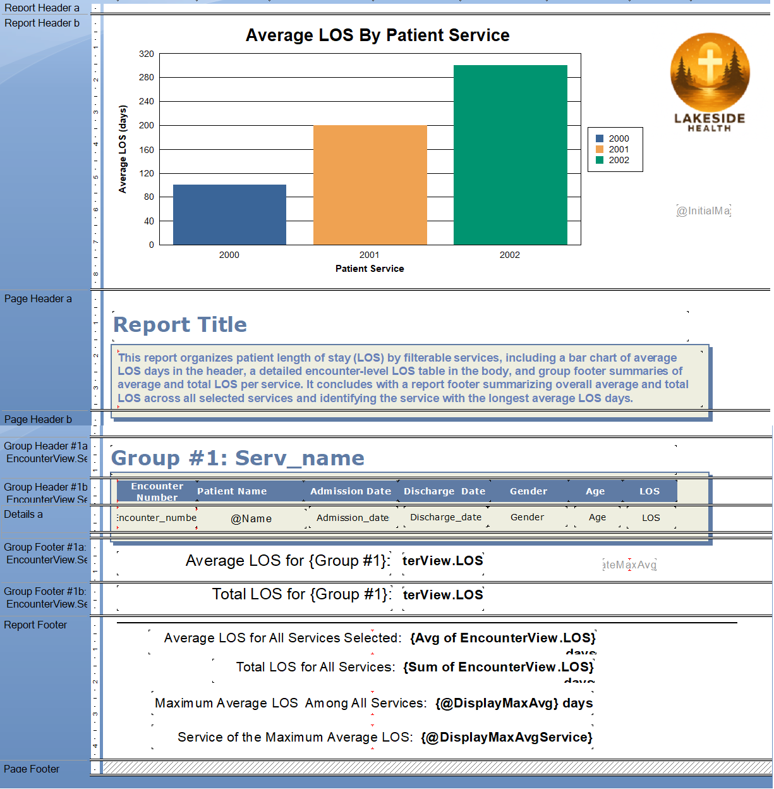
## Field Explorer
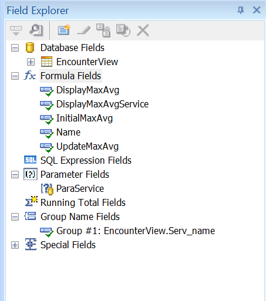
## Formula Field Name
Create a formula field Name combining the first name and the last name of the patient. Add Name to the report body as Patient Name field.
  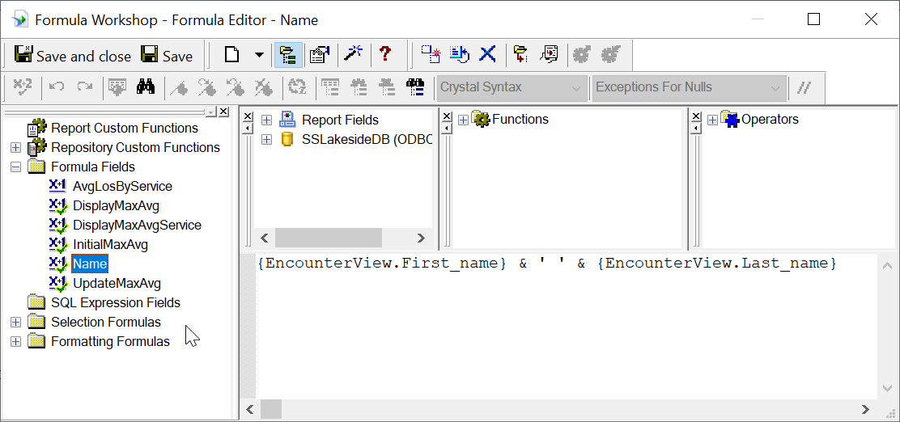
## Patient Service Parameter
Create a patient service parameter ParaService for user to filter specific services 
  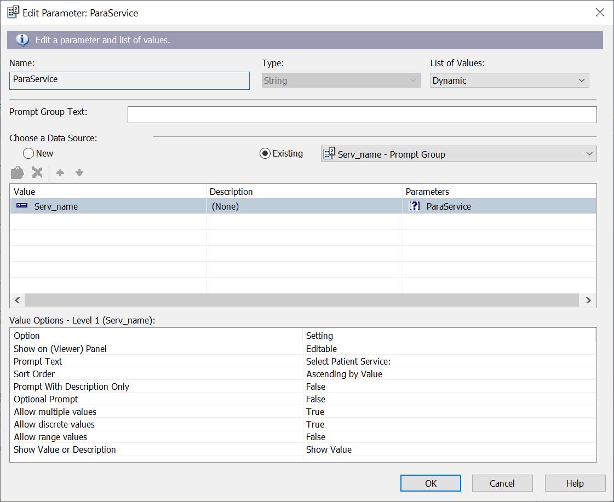
## Record Selection Formula
Write script for the Record Selection Formula inside Selection Formulas in Formula Workshop with the parameter field, ParaService, to display only the records based on the patient services that user selects. 
  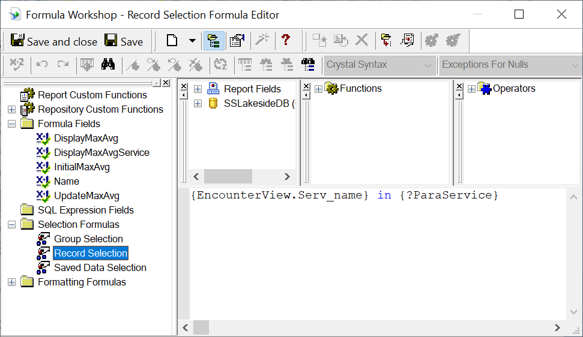
## Group Expert
This report is grouped by the column Serv_name (patient service name) in the EncounterView view as shown in Group Expert.
  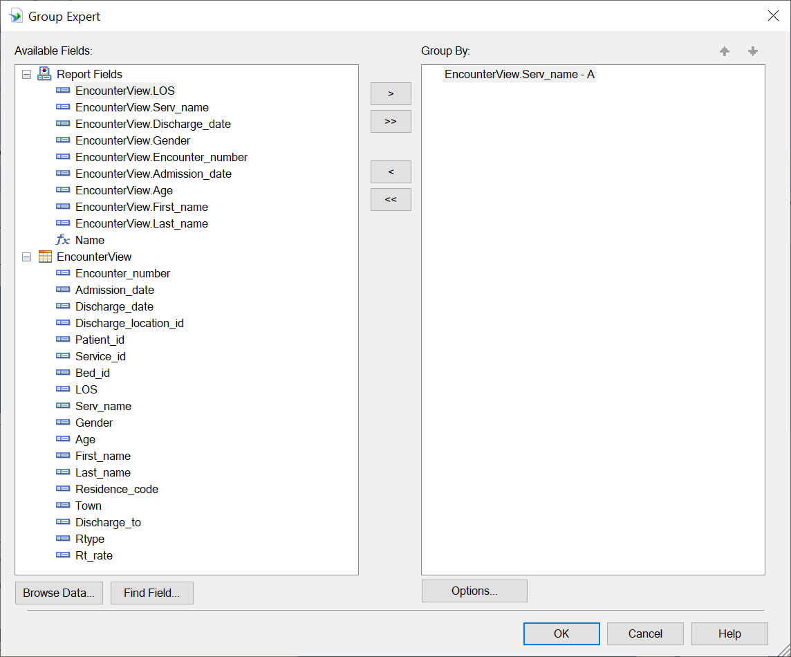
## Group Summary
Under the menu Insert select Summary to insert the average and the sum of LOS for each patient service as shown below to the Group Footer section.
  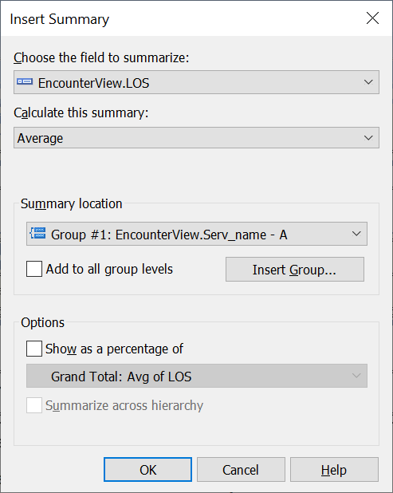
  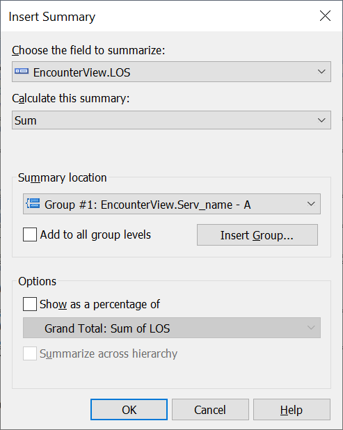
## Report Summary
Under the menu Insert select Summary to insert the average and the sum of LOS for all selected patient services as shown below to the Report Footer section.
  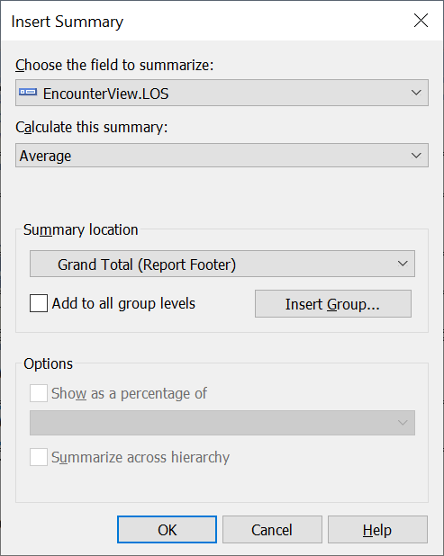
  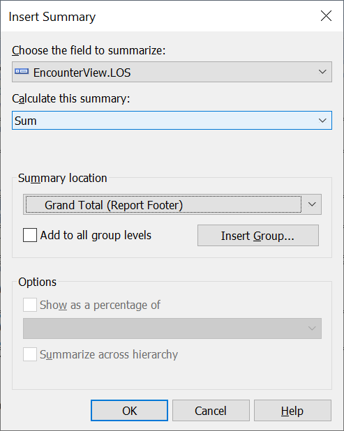
### Retrieve the Maximum Average Service LOS Days and the Corresponding Patient Service
#### Step 1：Create InitialMaxAvg Formula Field and write code inside the Formula Workshop as follows
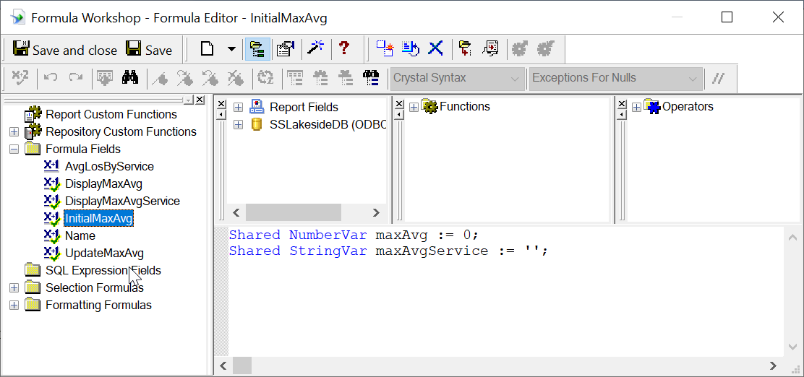
#### Step 2: Insert InitialMaxAvg to Report Header and hide it by check on Suppress in Common tab in Format Field Editor
#### Step 3: Create UpdateMaxAvg Formula Field and write code inside the Formula Workshop as follows
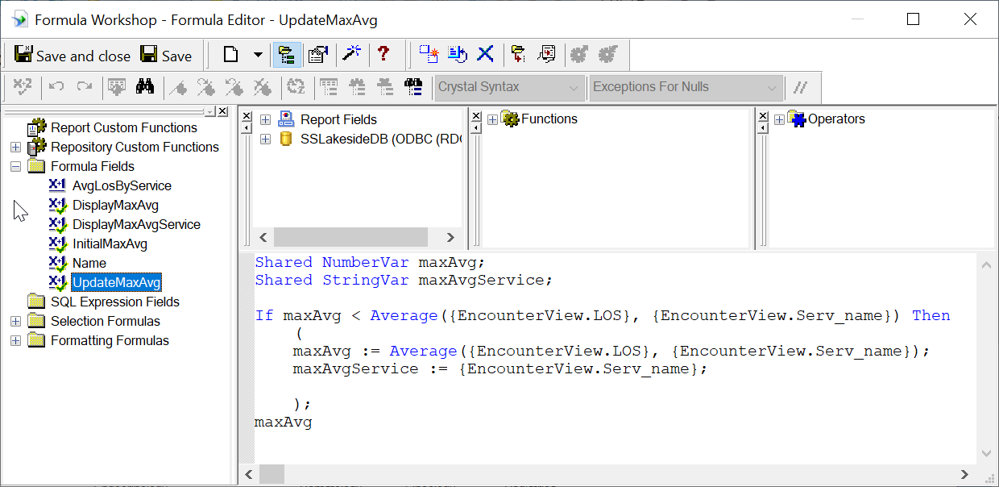
#### Step 4: Insert UpdateMaxAvg to Group Footer and hide it by check on Suppress in Common tab in Format Field Editor
#### Step 5: Create both DisplayMaxAvg and DisplayMaxAvgService Formula Fields and write code for them inside the Formula Workshop as follows
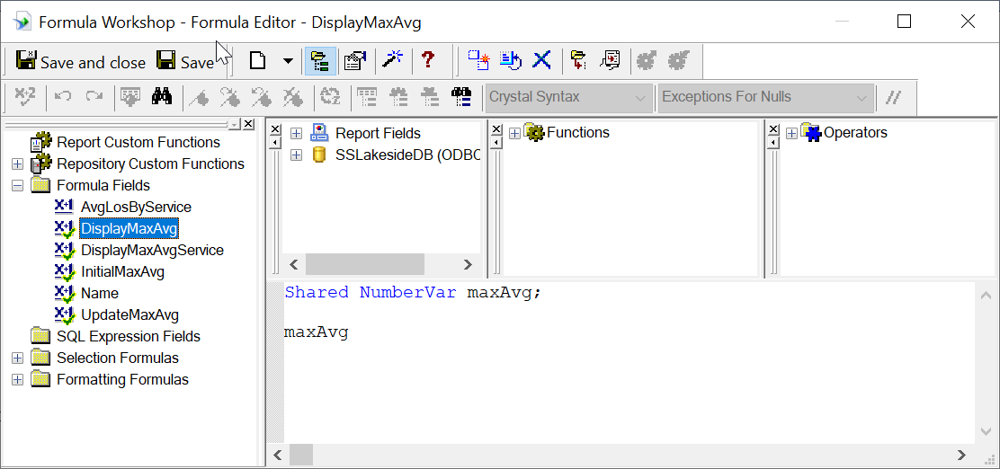
  
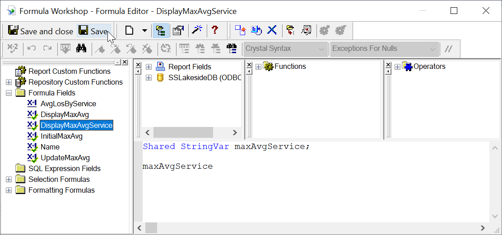
#### Step 6: Insert both DisplayMaxAvg and DisplayMaxAvgService to the proper place inside Report Footer

