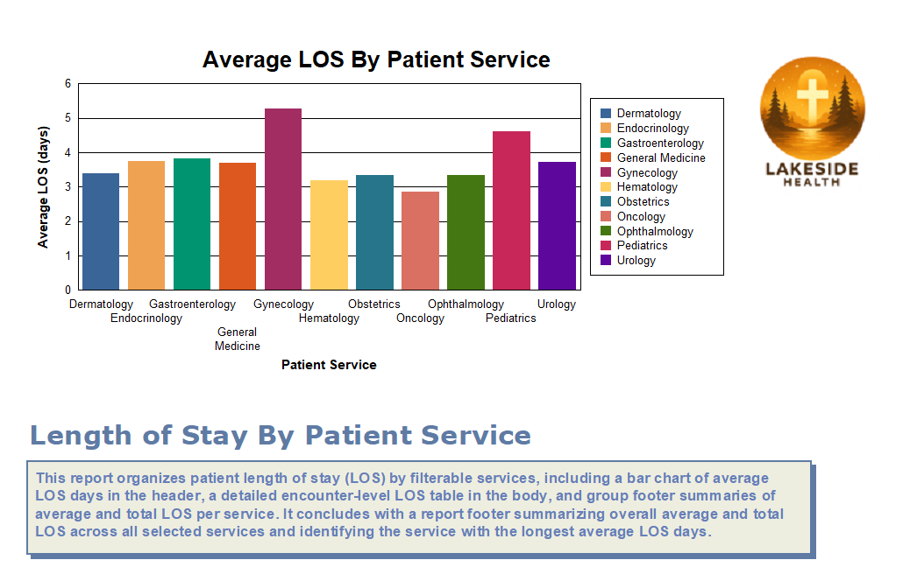
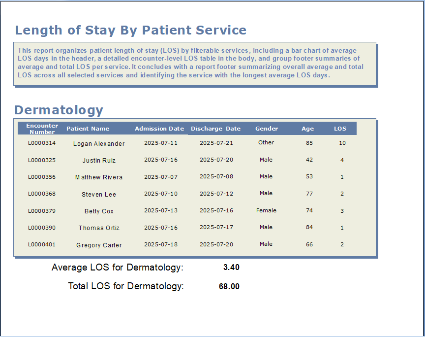
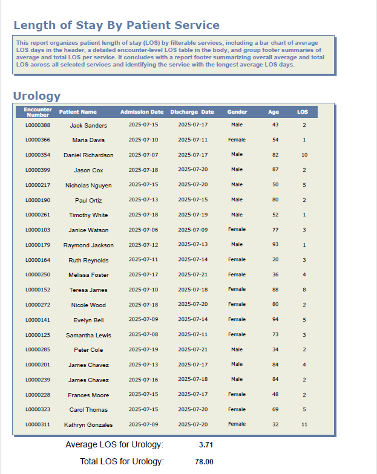
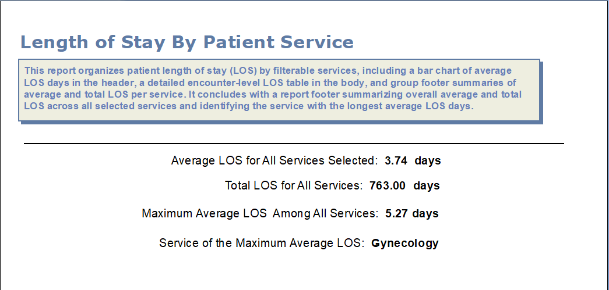
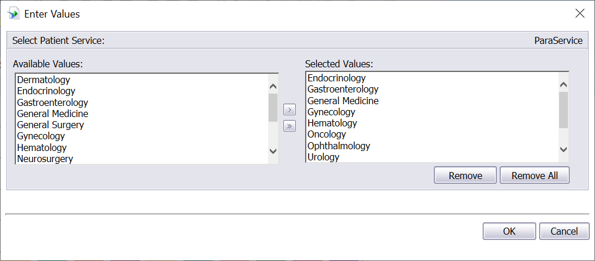

# Length of Stay By Patient Service Report
## Summary 
This report organizes patient length of stay (LOS) by filterable services, including a bar chart of average LOS days in the header, a detailed encounter-level LOS table in the body, and group footer summaries of average and total LOS per service. It concludes with a report footer summarizing overall average and total LOS across all selected services and identifying the service with the longest average LOS days. 
## Preview Report Header

## Partial Preview Report Body 

## Preview Report Footer

## Report Parameter Selection Dialog Box

