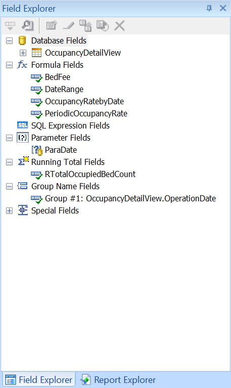
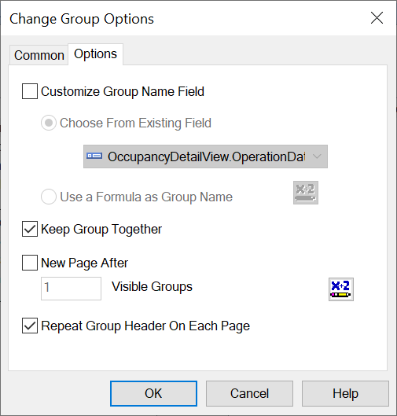
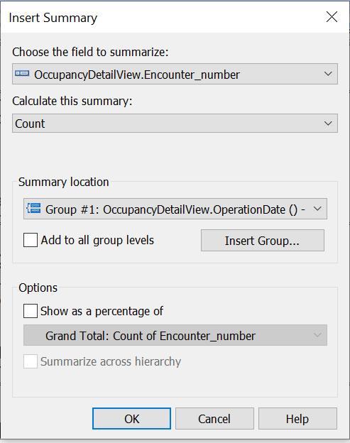

# Inpatient Bed Occupancy Report Development
## Data Source
The data for this report is retrieved from the view <b>OccupancyDetailView</b> in the database <b>LakesideInpatient</b>. Please refer to <a href='../../'>database</a> directory for the detail of the view.
  

## Design Panel

## Field Explorer

## Formula Field BedFee
Create a Formula Field BedFee to calculate the cost of bed occupancy for the admission. 
  

## Parameter Date
Create a parameter Date from the column OperationDate in the view for user to select the range of the date.
  

## Record Selection
Write script for the Record Selection Formula inside Selection Formulas in Formula Workshop with the parameter field, ParaDate, to display only the records based on the dates that user selects. 
  

## Group Expert
This report is grouped by the column OperationDate in the OccupancyDetailView view as shown in Group Expert.
  
  

 Check the box "Repeat Group Header On Each Page" in Group Expert Options to display group header on each page.
  
## Group Summary
### Design Overview

Under the menu Insert, select Summary to insert the total occupied beds per date as follows
  
  
Select Summary to insert the total bed fee per date as follows
  
  
Create a Formula Field OccupancyRateByDate to calculate the bed occupancy rate per date and insert it to the Group Footer
  

## Report Summary
