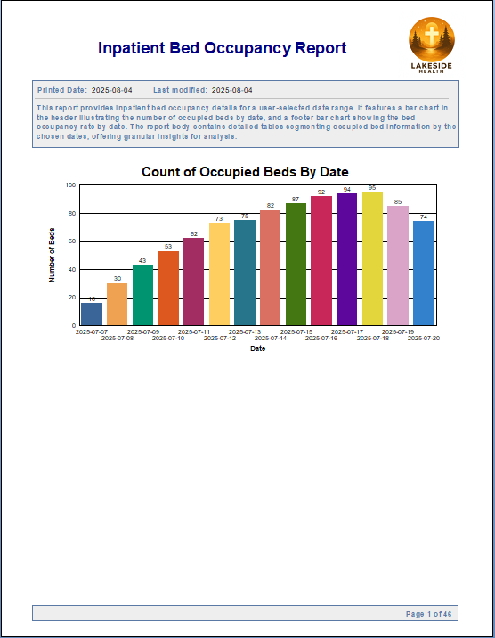
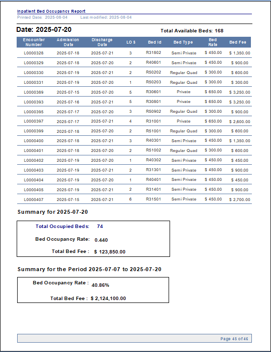
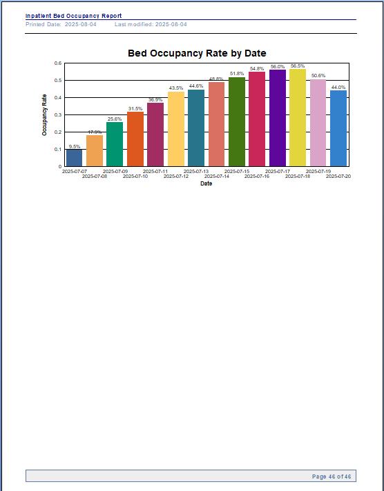

# Inpatient Bed Occupancy Report 
## Summary
This report provides inpatient bed occupancy details for a user-selected date range. It features a bar chart in the header illustrating the number of occupied beds by date, and a footer bar chart showing the bed occupancy rate by date. The report body contains detailed tables segmenting occupied bed information by the chosen dates, offering granular insights for analysis.
## Preview Report Header 

## Partial Preview Report Body
 
## Preview Report Footer

  

## Parameter Selection Dialog Box

