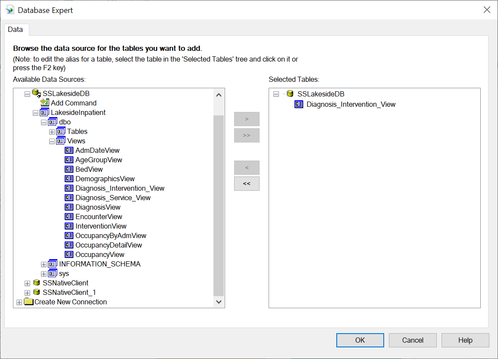
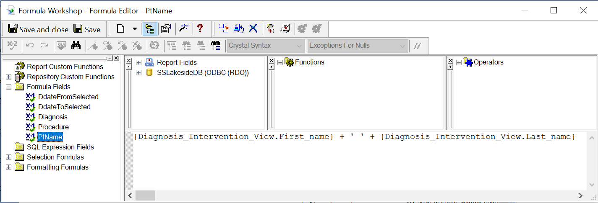
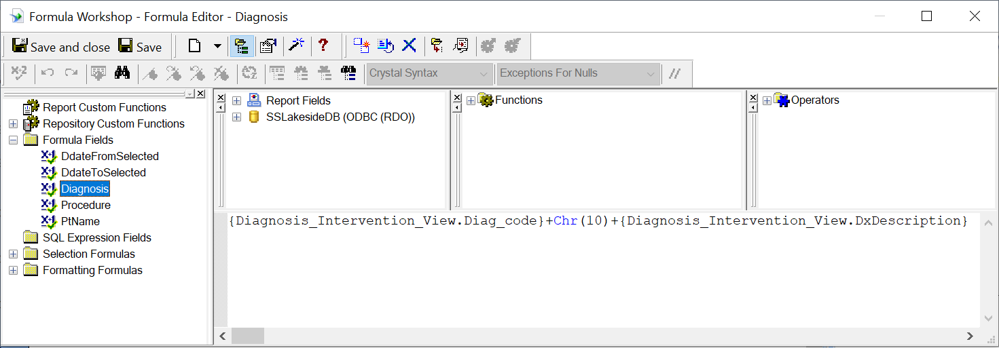
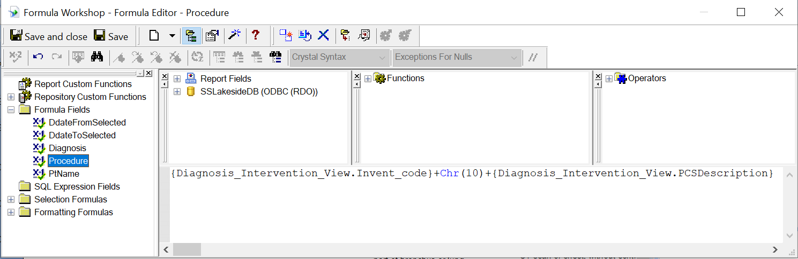
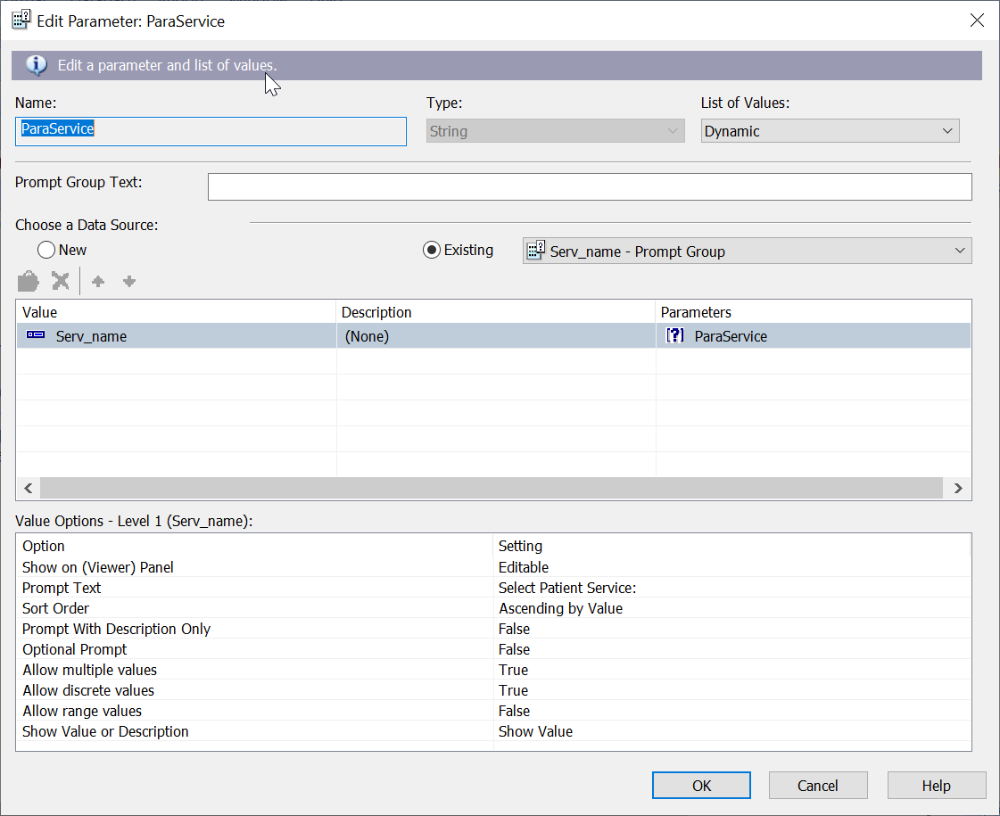
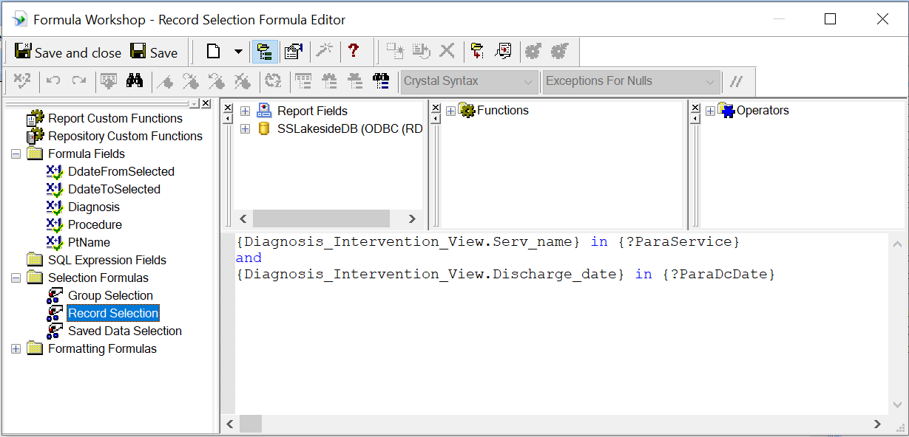
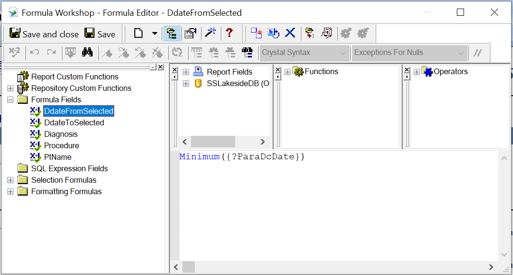
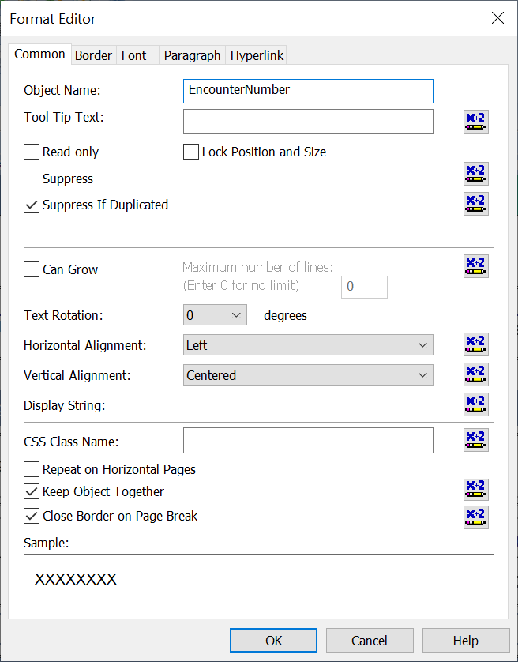

# Encounter Information By Patient Service Report Development
## Data Source 
### Diagnosis_Intervention_View
The data source for this report is from <b>Diagnosis_Intervention_View</b> view in the Database <b>LakesideInpatient</b>. 

## Report Design Panel

## Field Explorer

## Patient Name Formula Field
Create a formula field PtName combining the first name and the last name of the patient. Add PtName to the report body as Patient Name field.

## Diagnosis Formula Field
Create a formula field Diagnosis combining the diagnosis code and its corresponding description. Add Diagnosis to the report body as Diagnosis field.

## Procedure Formula Field
Create a formula field Procedure combining the procedure code and its corresponding description. Add Procedure to the report body as Procedure field.

## Patient Service Parameter
Create a patient service parameter ParaService for user to filter specific services 

## Discharge Date Parameter
Create a discharge date parameter ParaDcDate for user to choose discharge dates

## Record Selection Formula
Write script for the Record Selection Formula inside Selection Formulas in Formula Workshop with the parameter fields, ParaService and ParaDcDate, to display only the records based on the patient services and the discharge dates that user selects. 

## Discharge Date Start Formula Field
Create a formula field DdateFromSelected to get the value of discharge start date selected by user and insert it to the report page header and report footer

## Discharge Date End Formula Field
Create a formula field DdateToSelected to get the value of discharge end date selected by user and insert it to the report page header amd report footer.

## Suppress Duplicate Field Value
Under Format menu, choose Format Field to hide the duplicate field values for the same patient encounter in Format Editor by checking on Suppress If Duplicated option in Common tab. 

## Suppress Line in Detail
Choose the line in Detail section, right click on Format Line. Check on Suppress box In Format Line Editor and click on the square icon with beside it to open the Formula Workshop for the current formula.  

Write code to hide the line in Detail section in between records for the same encounter.

