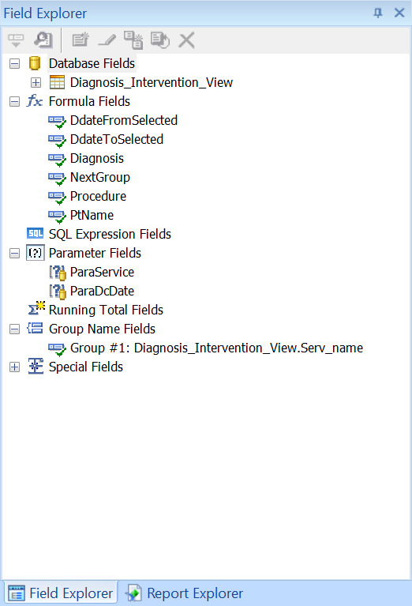

# Encounter Information By Patient Service Report Development
## Data Source 
The data for this report is from <b>Diagnosis_Intervention_View</b> view in the Database LakesideInpatient. 

## Report Design Panel

## Field Explorer

## Patient Name Field
Create a formula field PtName combining the first name and the last name of the patient. Add PtName to the report body as Patient Name field.

## Diagnosis Field
Create a formula field Diagnosis combining the diagnosis code and its corresponding description. Add Diagnosis to the report body as Diagnosis field.

## Procedure Field
Create a formula field Procedure combining the procedure code and its corresponding description. Add Procedure to the report body as Procedure field.

