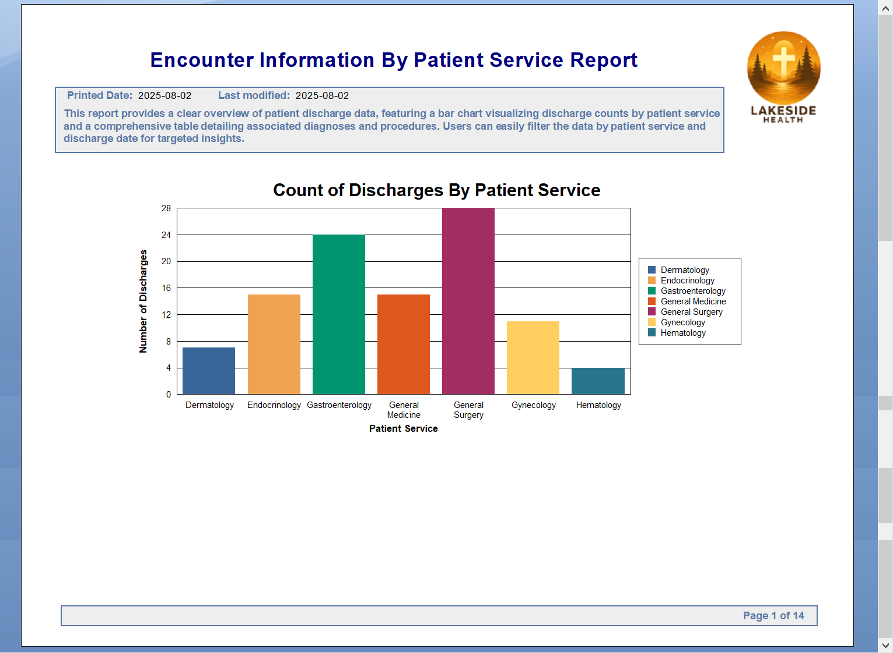
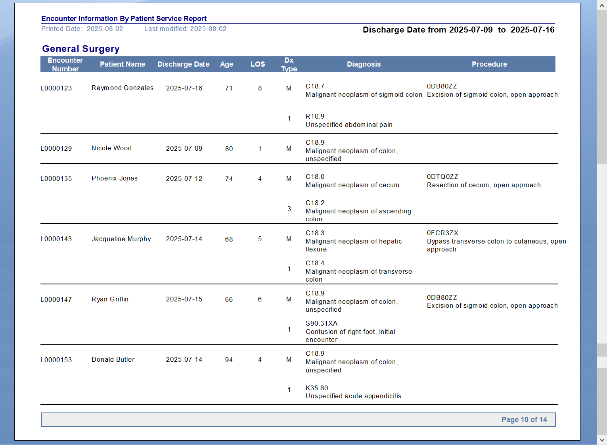
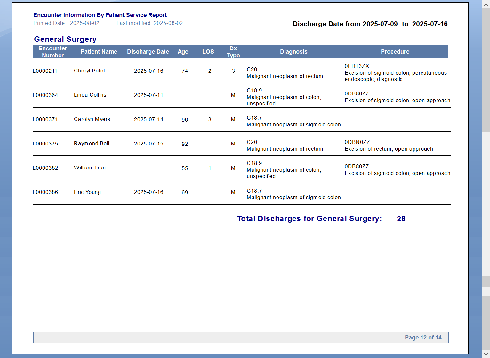
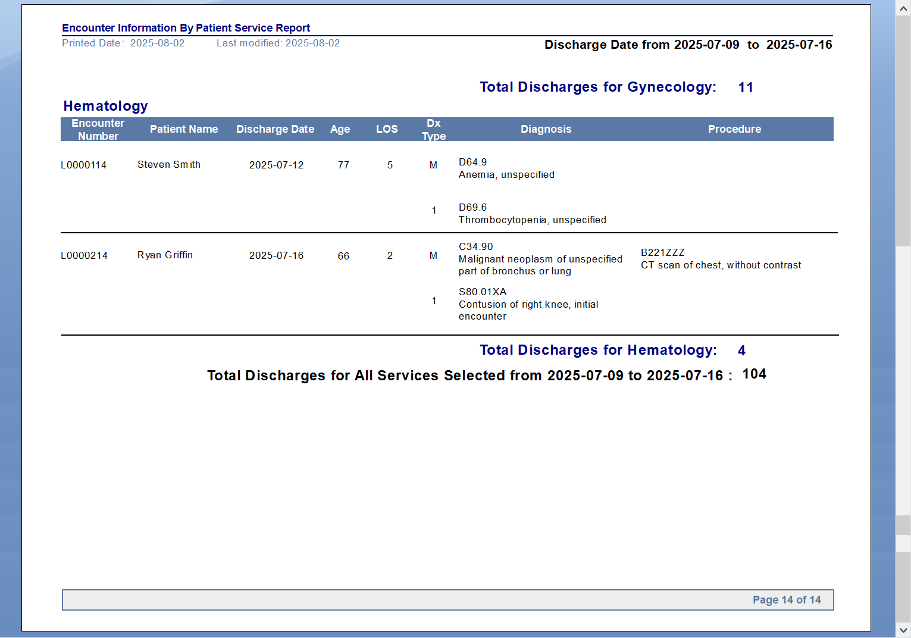

# Encounter Information By Patient Service Report
## Summary
This report provides a clear overview of patient discharge data, featuring a bar chart visualizing discharge counts by patient service and a comprehensive table detailing associated diagnoses and procedures. Users can easily filter the data by patient service and discharge date for targeted insights.
## Partial Report Preview
### Report Header

### Report Body

### Report Footer

