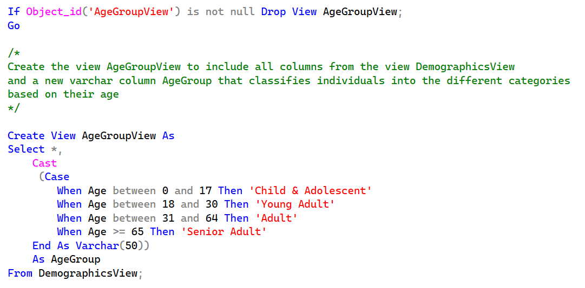

# Data Source for Reports
## <a href='../../CrystalReports/AgeGroupDistributionByResidence'>Patient Count by Age Group and Residence Report</a>

## <a href='../../CrystalReports/AveLOSByService'>Length of Stay by Patient Service Report</a>
## <a href='../../CrystalReports/BedOccupancyByDate'>Inpatient Bed Occupancy Report</a>
## <a href='../../CrystalReports/PtCountByService'>Encounter Information by Patient Service Report</a>
