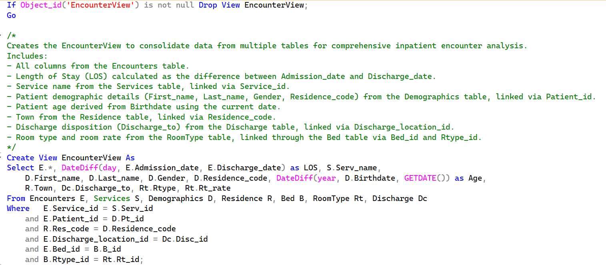
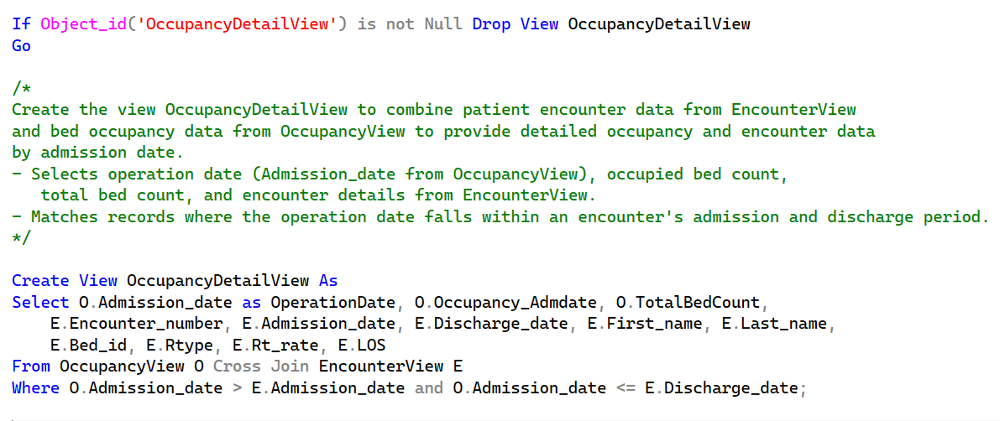
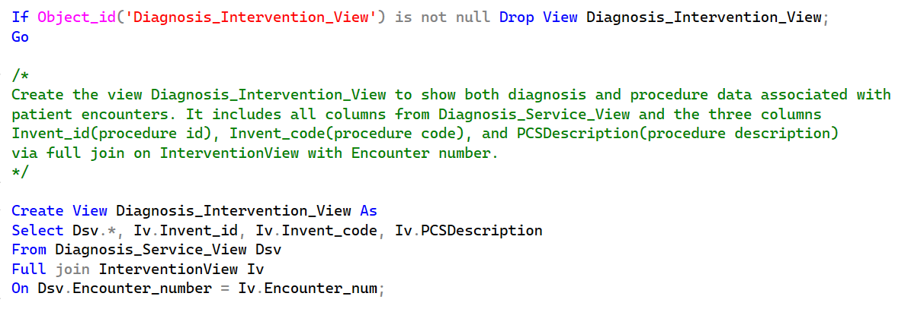

# Data Source for Reports
## <a href='../../CrystalReports/AgeGroupDistributionByResidence'>Patient Count by Age Group and Residence Report</a>
### Data Source: AgeGroupView

  
## <a href='../../CrystalReports/AveLOSByService'>Length of Stay by Patient Service Report</a>
### Data Source: EncounterView

  
## <a href='../../CrystalReports/BedOccupancyByDate'>Inpatient Bed Occupancy Report</a>
### Data Source: OccupancyDetailView

  
## <a href='../../CrystalReports/PtCountByService'>Encounter Information by Patient Service Report</a>
### Data Source: Diagnosis_Intervention_View

